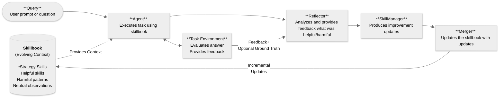

# Agentic Context Engine (ACE)


[](https://discord.gg/mqCqH7sTyK)
[](https://twitter.com/kaybaai)
[](https://badge.fury.io/py/ace-framework)
[](https://www.python.org/downloads/) 


**AI agents that get smarter with every task**

⭐ Star this repo if you find it useful!

---

## What is ACE?

ACE enables AI agents to **learn from their execution feedback**—what works, what doesn't—and continuously improve. No fine-tuning, no training data, just automatic in-context learning.

The framework maintains a **Skillbook**: a living document of strategies that evolves with each task. When your agent succeeds, ACE extracts patterns. When it fails, ACE learns what to avoid. All learning happens transparently in context.

- **Self-Improving**: Agents autonomously get smarter with each task
- **20-35% Better Performance**: Proven improvements on complex tasks
- **49% Token Reduction**: Demonstrated in browser automation benchmarks
- **No Context Collapse**: Preserves valuable knowledge over time

---

## LLM Quickstart
1. Direct your favorite coding agent (Cursor, Claude Code, Codex, etc) to [Quick Start Guide](docs/QUICK_START.md)
2. Prompt away!

---

## Quick Start

### 1. Install

```bash
pip install ace-framework
```

### 2. Set API Key

```bash
export OPENAI_API_KEY="your-api-key"
```

### 3. Run

```python
from ace import ACELiteLLM

agent = ACELiteLLM(model="gpt-4o-mini")

answer = agent.ask("What does Kayba's ACE framework do?")
print(answer)  # "ACE allows AI agents to remember and learn from experience!"
```

**Done! Your agent learns automatically from each interaction.**

[→ Quick Start Guide](docs/QUICK_START.md) | [→ Setup Guide](docs/SETUP_GUIDE.md)

---

## Use Cases

### Enhance Existing Agents
Wrap your existing agent (browser-use, LangChain, custom) with ACE learning. Your agent executes tasks normally while ACE analyzes results and builds a skillbook of effective strategies.

### Automated System Prompting
The Skillbook acts as an evolving system prompt that automatically improves based on execution feedback—no manual prompt engineering required.

### Claude Code with Learning
Run coding tasks with Claude Code while ACE learns patterns from each execution, building expertise over time for your specific codebase and workflows.

Create your self-improving agent:

<details>
<summary>Click to view code example</summary>

```python
from ace import ACELiteLLM

# Create self-improving agent
agent = ACELiteLLM(model="gpt-4o-mini")

# Ask related questions - agent learns patterns
answer1 = agent.ask("If all cats are animals, is Felix (a cat) an animal?")
answer2 = agent.ask("If all birds fly, can penguins (birds) fly?")  # Learns to check assumptions!
answer3 = agent.ask("If all metals conduct electricity, does copper conduct electricity?")

# View learned strategies
print(f"✅ Learned {len(agent.skillbook.skills())} reasoning skills")

# Save for reuse
agent.save_skillbook("my_agent.json")

# Load and continue
agent2 = ACELiteLLM.from_skillbook("my_agent.json", model="gpt-4o-mini")
```

</details>
<br>

### 2. **ACELangChain** - Wrap ACE Around Your Existing Agent ⛓️

Wrap any LangChain chain/agent with learning:

**Best for:** Multi-step workflows, tool-using agents

<details>
<summary>Click to view code example</summary>

```python
from ace import ACELangChain

ace_chain = ACELangChain(runnable=your_langchain_chain)
result = ace_chain.invoke({"question": "Your task"})  # Learns automatically
```

</details>
<br>

### 3. **ACEAgent** - Enhance Browser-Use Agent with Self-Optimizing 🌐

Self-improving browser agents with [browser-use](https://github.com/browser-use/browser-use):

**Features:** Drop-in replacement for `browser_use.Agent`, automatic learning, reusable skillbooks
**[→ Browser Use Guide](examples/browser-use/README.md)**

<details>
<summary>Click to view code example</summary>

```bash
pip install ace-framework[browser-use]
```

```python
from ace import ACEAgent
from browser_use import ChatBrowserUse

# Two LLMs: ChatBrowserUse for browser, gpt-4o-mini for ACE learning
agent = ACEAgent(
    llm=ChatBrowserUse(),      # Browser execution
    ace_model="gpt-4o-mini"    # ACE learning
)

await agent.run(task="Find top Hacker News post")
agent.save_skillbook("hn_expert.json")

# Reuse learned knowledge
agent = ACEAgent(llm=ChatBrowserUse(), skillbook_path="hn_expert.json")
await agent.run(task="New task")  # Starts smart!
```

</details>
<br>

### 4. **ACEClaudeCode** - Claude Code CLI 💻

Self-improving coding agent using [Claude Code](https://claude.ai/code):

**Features:** Claude Code CLI wrapper, automatic learning, task execution traces
**[→ Claude Code Loop Example](examples/claude-code-loop/)**

<details>
<summary>Click to view code example</summary>

```python
from ace import ACEClaudeCode

agent = ACEClaudeCode(
    working_dir="./my_project",
    ace_model="gpt-4o-mini"
)

# Execute coding tasks - agent learns from each
result = agent.run(task="Add unit tests for utils.py")
agent.save_skillbook("coding_expert.json")

# Reuse learned knowledge
agent = ACEClaudeCode(working_dir="./project", skillbook_path="coding_expert.json")
```

</details>

### **Claude Code Integration** - Learn While You Code 💻

ACE integrates directly with [Claude Code](https://claude.ai/code) to learn from your coding sessions:

```bash
# Install
pip install ace-framework

# After a Claude Code session, learn from it
ace-learn

# Check prerequisites (transcripts, project detection, patched cli.js status)
ace-learn doctor
```

No API keys required: `ace-learn` uses your existing Claude Code subscription (via the `claude` CLI) and reads Claude Code transcripts from `~/.claude/projects/`.

**Project root detection:**
- ACE writes to your project root (`<project>/CLAUDE.md` and `<project>/.ace/skillbook.json`).
- In monorepos, create a `.ace-root` file at the repo root (or use `ACE_PROJECT_DIR` / `ace-learn --project`).

**Slash Commands:**
- Optional: create `~/.claude/commands/ace-learn.md` to use `/ace-learn` inside Claude Code (Claude slash commands are just Markdown files).
- Other useful commands mirror the CLI: `/ace-insights`, `/ace-remove`, `/ace-clear` (if you create matching files in `~/.claude/commands/`).

**CLI Commands:**
```bash
ace-learn             # Learn from latest transcript, update CLAUDE.md
ace-learn --lines 500 # Learn from last N transcript lines only
ace-learn doctor      # Verify prerequisites and configuration
ace-learn insights    # Show learned strategies
ace-learn remove <id> # Remove insight by ID
ace-learn clear --confirm # Reset skillbook
```

**How it works:** You trigger learning manually by running `ace-learn`, which reads the latest Claude Code transcript and writes learned strategies into your project's `CLAUDE.md` (plus a persistent `.ace/skillbook.json`).

---

## Why Agentic Context Engine (ACE)?

AI agents make the same mistakes repeatedly.

ACE enables agents to learn from execution feedback: what works, what doesn't, and continuously improve. <br> No training data, no fine-tuning, just automatic improvement.

### Clear Benefits
- 🧠 **Self-Improving**: Agents autonomously get smarter with each task
- 📈 **20-35% Better Performance**: Proven improvements on complex tasks
- 📉 **Reduce Token Usage**: Demonstrated 49% reduction in browser-use example

### Features
- 🔄 **No Context Collapse**: Preserves valuable knowledge over time
- ⚡ **Async Learning**: Agent responds instantly while learning happens in background
- 🚀 **100+ LLM Providers**: Works with OpenAI, Anthropic, Google, and more
- 📊 **Production Observability**: Built-in Opik integration for enterprise monitoring
- 🔄 **Smart Deduplication**: Automatically consolidates similar skills

### Build Self-Improving Agents
Create new agents with built-in learning for customer support, data extraction, code generation, research, content creation, and task automation.

---

## Demos

### The Seahorse Emoji Challenge

A challenge where LLMs often hallucinate that a seahorse emoji exists (it doesn't).


In this example:
1. The agent incorrectly outputs a horse emoji
2. ACE reflects on the mistake without external feedback
3. On the second attempt, the agent correctly realizes there is no seahorse emoji

[→ Try it yourself](examples/litellm/seahorse_emoji_ace.py)

### Browser Automation

**Online Shopping Demo**: ACE vs baseline agent shopping for 5 grocery items.


In this example:
- ACE learns to navigate the website over 10 attempts
- Performance stabilizes and step count decreases by 29.8%
- Token costs reduce 49.0% for base agent and 42.6% including ACE overhead

[→ Try it yourself & see all demos](examples/browser-use/README.md)

### Claude Code Loop

In this example, Claude Code is enhanced with ACE and self-reflects after each execution while translating the ACE library from Python to TypeScript.

**Python → TypeScript Translation:**

| Metric | Result |
|--------|--------|
| Duration | ~4 hours |
| Commits | 119 |
| Lines written | ~14k |
| Outcome | Zero build errors, all tests passing |
| API cost | ~$1.5 (Sonnet for learning) |

[→ Claude Code Loop](examples/claude-code-loop/)

---

## Integrations

ACE integrates with popular agent frameworks:

| Integration | ACE Class | Use Case |
|-------------|-----------|----------|
| LiteLLM | `ACELiteLLM` | Simple self-improving agent |
| LangChain | `ACELangChain` | Wrap LangChain chains/agents |
| browser-use | `ACEAgent` | Browser automation |
| Claude Code | `ACEClaudeCode` | Claude Code CLI |
| Opik | `OpikIntegration` | Production monitoring and cost tracking |

[→ Integration Guide](docs/INTEGRATION_GUIDE.md) | [→ Examples](examples/)

---

## How Does ACE Work?

*Based on the [ACE research framework](https://arxiv.org/abs/2510.04618) from Stanford & SambaNova.*

ACE uses three specialized roles that work together:
1. **Agent** - Creates a plan using learned skills and executes the task
2. **Reflector** - Analyzes what worked and what didn't after execution
3. **SkillManager** - Updates the skillbook with new strategies based on reflection

**Important:** The three ACE roles are different specialized prompts using the same language model, not separate models.

ACE teaches your agent and internalizes:
- **Successes** → Extract patterns that work
- **Failures** → Learn what to avoid
- **Tool usage** → Discover which tools work best for which tasks
- **Edge cases** → Remember rare scenarios and how to handle them

The magic happens in the **Skillbook**—a living document of skills that evolves with experience.
**Key innovation:** All learning happens **in context** through incremental updates—no fine-tuning, no training data, and complete transparency into what your agent learned.



---

## Documentation

- [Quick Start Guide](docs/QUICK_START.md) - Get running in 5 minutes
- [Setup Guide](docs/SETUP_GUIDE.md) - Installation, configuration, providers
- [Integration Guide](docs/INTEGRATION_GUIDE.md) - Add ACE to existing agents
- [API Reference](docs/API_REFERENCE.md) - Complete API documentation
- [Complete Guide to ACE](docs/COMPLETE_GUIDE_TO_ACE.md) - Deep dive into concepts
- [Prompt Engineering](docs/PROMPT_ENGINEERING.md) - Advanced prompt techniques
- [Agentic System Prompting](examples/agentic-system-prompting/README.md) - Automatically generate prompt improvements from past traces
- [Examples](examples/) - Ready-to-run code examples
- [Benchmarks](benchmarks/README.md) - Evaluate ACE performance
- [Changelog](CHANGELOG.md) - Recent changes

---

## Contributing

We love contributions! Check out our [Contributing Guide](CONTRIBUTING.md) to get started.

---

## Acknowledgment

Based on the [ACE paper](https://arxiv.org/abs/2510.04618) and inspired by [Dynamic Cheatsheet](https://arxiv.org/abs/2504.07952).

If you use ACE in your research, please cite:
```bibtex
@article{zhang2024ace,title={Agentic Context Engineering},author={Zhang et al.},journal={arXiv:2510.04618},year={2024}}
```

---

<div align="center">

**⭐ Star this repo if you find it useful!**

**Built with ❤️ by [Kayba](https://kayba.ai) and the open-source community.**

</div>
